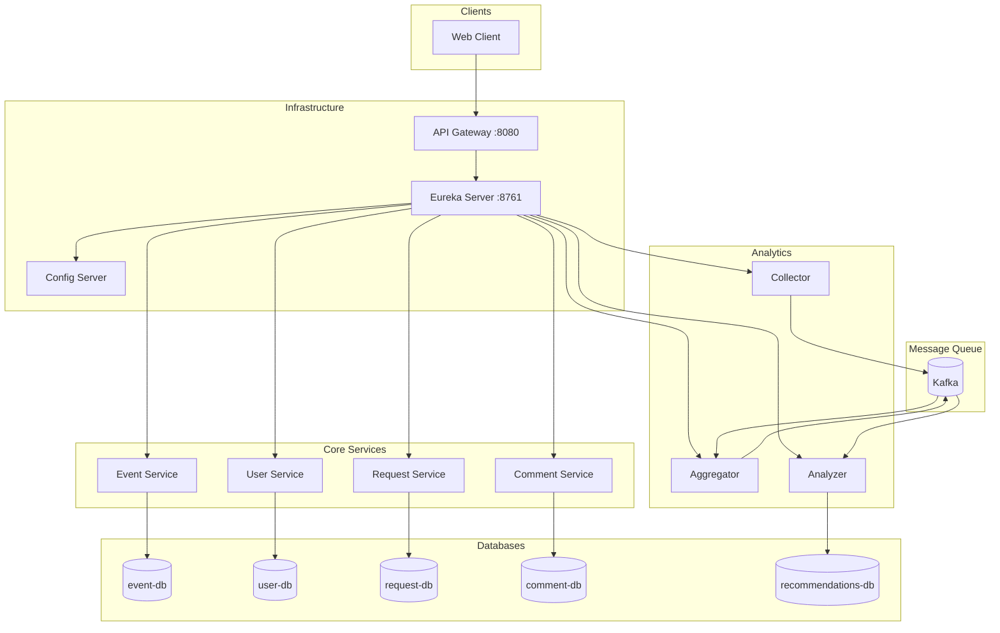

# Explore With Me — платформа для поиска событий с рекомендательной системой

[](https://adoptium.net/)
[](https://spring.io/projects/spring-boot)
[](https://spring.io/projects/spring-cloud)
[](https://www.docker.com/)
[](https://kafka.apache.org/)
[](https://www.postgresql.org/)
[](https://grpc.io/)

**Explore With Me** — это распределённая платформа для поиска, участия и рекомендации событий (концертов, выставок,
лекций). Пользователи могут создавать события, участвовать в них, оставлять комментарии и получать персонализированные
рекомендации на основе своего поведения.

Проект демонстрирует **production-ready микросервисную архитектуру**:

- Service Discovery (Netflix Eureka)
- API Gateway (Spring Cloud Gateway)
- Centralized Configuration (Spring Cloud Config Server)
- Асинхронное взаимодействие (Apache Kafka + Avro)
- Синхронное RPC (gRPC + Protobuf)
- Database-per-service (PostgreSQL)

## 🏗️ Архитектура

Система построена по принципу **database-per-service** и включает 10+ микросервисов:

| Компонент            | Технология           | Назначение                                 |
|----------------------|----------------------|--------------------------------------------|
| **discovery-server** | Netflix Eureka       | Регистрация и обнаружение сервисов         |
| **config-server**    | Spring Cloud Config  | Централизованное управление конфигурациями |
| **gateway-server**   | Spring Cloud Gateway | Единая точка входа, маршрутизация          |
| **event-service**    | Spring Boot + JPA    | Управление событиями                       |
| **user-service**     | Spring Boot + JPA    | Управление пользователями                  |
| **request-service**  | Spring Boot + JPA    | Заявки на участие                          |
| **comment-service**  | Spring Boot + JPA    | Комментарии к событиям                     |
| **collector**        | Spring Boot + Kafka  | Сбор действий пользователей                |
| **aggregator**       | Spring Boot + Kafka  | Агрегация данных                           |
| **analyzer**         | Spring Boot + gRPC   | Рекомендации (косинусное сходство)         |

### Схема взаимодействия



## 📚 Документация API

### Core Services (REST API)

| Сервис              | Документация                                                         | Описание                                      |
|---------------------|----------------------------------------------------------------------|-----------------------------------------------|
| **Event Service**   | [api-rest-event-service.md](docs/core/api-rest-event-service.md)     | Управление событиями, категориями, подборками |
| **User Service**    | [api-rest-user-service.md](docs/core/api-rest-user-service.md)       | Управление пользователями                     |
| **Request Service** | [api-rest-request-service.md](docs/core/api-rest-request-service.md) | Заявки на участие в событиях                  |
| **Comment Service** | [api-rest-comment-service.md](docs/core/api-rest-comment-service.md) | Комментарии к событиям                        |

### Stats Services (Recommendations)

| Компонент         | Документация                                                     | Описание                         |
|-------------------|------------------------------------------------------------------|----------------------------------|
| **gRPC API**      | [grpc-api.md](docs/stats(recommendations)/grpc-api.md)           | gRPC методы collector и analyzer |
| **Kafka Schemas** | [kafka-schemas.md](docs/stats(recommendations)/kafka-schemas.md) | Avro схемы и топики              |

## 🚀 Быстрый старт

### Требования

- **Docker** 26.0+ и **Docker Compose** V2
- **Java** 21 (только для разработки и сборки)
- **Git**

### Запуск всех сервисов

```bash
# 1. Склонировать репозиторий
git clone https://github.com/Leonid-353/java-plus-graduation
cd java-plus-graduation
```

```bash
# 2. Собрать все сервисы (один раз или после изменений)
mvn clean package
```

```bash
# 3. Запустить через Docker Compose
docker-compose up -d
```

### Проверка работоспособности

| Сервис               | URL                   | Назначение           |
|----------------------|-----------------------|----------------------|
| **Eureka Dashboard** | http://localhost:8761 | Статус всех сервисов |
| **API Gateway**      | http://localhost:8080 | Единая точка входа   |

После запуска все 10+ микросервисов автоматически зарегистрируются в Eureka.

### Остановка

```bash
docker-compose down
```

### Просмотр логов

```bash
# Логи всех сервисов
docker-compose logs -f
```

```bash
# Логи конкретного сервиса
docker-compose logs -f event-service
```

```bash
docker-compose logs -f collector
```

## 📊 Мониторинг

### Проверка статуса сервисов в Eureka

Откройте в браузере: http://localhost:8761

Все сервисы должны быть в статусе **UP**:

- CONFIG-SERVER
- GATEWAY-SERVER
- EVENT-SERVICE
- USER-SERVICE
- REQUEST-SERVICE
- COMMENT-SERVICE
- COLLECTOR
- AGGREGATOR
- ANALYZER

## 🧪 Тестирование

### Postman-коллекция

📌 **API тестирование**: после запуска проекта используйте [Postman-коллекцию](./postman) для работы с API.

В папке `/postman` находится коллекция для тестирования API. Импортируйте её в Postman и выполните запросы.

### Тестирование статистического блока

Для проверки работы collector, aggregator и analyzer используется специальный тестер.

#### Запуск тестера

⚠️ **Важно:** перед запуском тестера необходимо вручную запустить все сервисы в IDE

Тестер находится в корне проекта: `tester-0.0.1.jar`

#### Настройка генерации данных

| Параметр                                               | Описание                             | Значение по умолчанию |
|--------------------------------------------------------|--------------------------------------|-----------------------|
| `tester.generation.user-count`                         | Диапазон количества пользователей    | `5 - 15`              |
| `tester.generation.event-count`                        | Диапазон количества мероприятий      | `10 - 20`             |
| `tester.generation.actions-limit`                      | Лимит суммарного количества действий | `50 - 100`            |
| `tester.generation.timestamp-settings.back`            | Смещение первой метки назад          | `3d`                  |
| `tester.generation.timestamp-settings.increment-start` | Минимальный интервал между метками   | `1m`                  |
| `tester.generation.timestamp-settings.increment-end`   | Максимальный интервал между метками  | `10m`                 |

#### Режимы выполнения

| Режим         | Описание                                            |
|---------------|-----------------------------------------------------|
| `COLLECTION`  | Проверка только collector                           |
| `AGGREGATION` | Проверка collector + aggregator                     |
| `ANALYZE`     | Полная проверка (collector + aggregator + analyzer) |

#### Пример запуска

```bash
# Запуск в режиме ANALYZE, сохранение отчёта в файл
java -jar tester.jar --tester.execution.mode=ANALYZE --tester.execution.output.file-path=./report.txt
```

#### Настройки вывода результатов

| Параметр                                     | Описание                   | По умолчанию               |
|----------------------------------------------|----------------------------|----------------------------|
| `tester.execution.immediate-logging.enabled` | Логировать в консоль сразу | `false`                    |
| `tester.execution.output.info-enabled`       | Выводить INFO сообщения    | `true`                     |
| `tester.execution.output.trace-enabled`      | Выводить TRACE сообщения   | `true`                     |
| `tester.execution.output.print`              | Выводить отчёт в консоль   | `true`                     |
| `tester.execution.output.file`               | Сохранять отчёт в файл     | `true`                     |
| `tester.execution.output.file-path`          | Путь к файлу отчёта        | `"./execution-report.txt"` |

## 🛠️ Технологический стек

### Backend

| Категория                       | Технологии                                           |
|---------------------------------|------------------------------------------------------|
| **Язык**                        | Java 21                                              |
| **Фреймворк**                   | Spring Boot 3.3, Spring Cloud 2023.0.3               |
| **Микросервисы**                | Spring Cloud Netflix Eureka, Spring Cloud Gateway    |
| **Конфигурация**                | Spring Cloud Config Server                           |
| **Межсервисное взаимодействие** | Spring Cloud OpenFeign, gRPC 1.63.0, Protobuf 3.23.4 |
| **Базы данных**                 | PostgreSQL 16, Spring Data JPA, Hibernate            |
| **Сообщения**                   | Apache Kafka 3.6.1, Avro 1.11.3                      |
| **Сборка**                      | Apache Maven                                         |
| **Контейнеризация**             | Docker, Docker Compose                               |

### Инфраструктура

- **Service Discovery**: Netflix Eureka
- **API Gateway**: Spring Cloud Gateway
- **Config Management**: Spring Cloud Config (native backend)
- **Message Broker**: Apache Kafka
- **Databases**: PostgreSQL (5 отдельных экземпляров)

## 📁 Структура проекта

```plaintext
explore-with-me/
├── core/ # Основные бизнес-сервисы
│ ├── event-service/ # Управление событиями
│ ├── user-service/ # Управление пользователями
│ ├── request-service/ # Заявки на участие
│ ├── comment-service/ # Комментарии к событиям
│ └── interaction-api/ # Общие DTO и API-контракты
│
├── stats/ # Сервисы аналитики и рекомендаций
│ ├── collector/ # Сбор действий пользователей → Kafka
│ ├── aggregator/ # Агрегация данных из Kafka
│ ├── analyzer/ # Рекомендации (косинусное сходство)
│ ├── serialization/ # Avro/Protobuf схемы
│ │ ├── avro-schemas/
│ │ └── proto-schemas/
│ ├── stats-client/ # Клиент для взаимодействия
│ └── stats-server/ # REST API для статистики (устарело)
│
├── infra/ # Инфраструктурные сервисы
│ ├── discovery-server/ # Eureka Server
│ ├── config-server/ # Config Server (native)
│ └── gateway-server/ # API Gateway
│
├── docs/ # Документация API
│ ├── core/ # REST API core-сервисов
│ │ ├── api-rest-event-service.md
│ │ ├── api-rest-user-service.md
│ │ ├── api-rest-request-service.md
│ │ └── api-rest-comment-service.md
│ └── stats/ # Документация stats-сервисов
│     ├── grpc-api.md
│     └── kafka-schemas.md
│
├── postman/ # Postman-коллекции для тестирования
├── tester-0.0.1.jar # Тестирование статистического блока
├── docker-compose.yml # Оркестрация всех 12+ контейнеров
├── pom.xml # Корневой Maven POM
└── README.md
```

## 📈 Масштабирование

Архитектура позволяет горизонтально масштабировать любой сервис.

⚠️ **Важно:** Для масштабирования необходимо удалить фиксированные `container_name` из `docker-compose.yml` или
использовать Docker Swarm/Kubernetes.

### Пример масштабирования (без фиксированных имён)

```bash
# Запустить 3 экземпляра event-service
docker-compose up --scale event-service=3 -d
```

Eureka автоматически распределит нагрузку между инстансами.

### Проверка масштабирования

```bash
# Проверить количество запущенных экземпляров
docker ps | grep event-service
```

> **Примечание:** В текущей конфигурации `container_name` заданы для удобства отладки. Для продакшн-окружения
> рекомендуется убрать фиксированные имена или использовать оркестрацию (Kubernetes).

## 👨‍💻 Автор

**Leonid** — Java-разработчик

- **GitHub:** [Leonid-353](https://github.com/Leonid-353)
- **Telegram:** [@LeonidS353](https://t.me/LeonidS353)
- **Email:** leonidkamka353@yandex.ru

---

## 📄 Лицензия

MIT License

---

## ⭐ Если проект оказался полезным

Поставьте звезду на GitHub — это поможет другим разработчикам найти проект и вдохновит на новые улучшения!