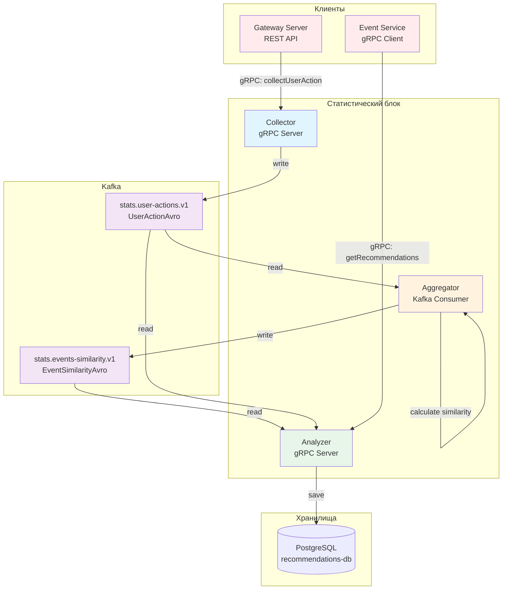

# gRPC API Документация

## Обзор

В проекте используется gRPC для межсервисного взаимодействия в статистическом блоке:

- **collector** — принимает действия пользователей через gRPC
- **analyzer** — предоставляет рекомендации через gRPC

---

## Сервис UserActionController (collector)

### Определение сервиса

```proto
service UserActionController {
   rpc CollectUserAction (UserActionProto) returns (google.protobuf.Empty);
}
```

### Сообщения

#### ActionTypeProto

| Значение          | Описание               |
|-------------------|------------------------|
| `ACTION_VIEW`     | Просмотр события       |
| `ACTION_REGISTER` | Регистрация на событие |
| `ACTION_LIKE`     | Лайк события           |

#### UserActionProto

| Поле          | Тип                       | Описание        |
|---------------|---------------------------|-----------------|
| `user_id`     | int64                     | ID пользователя |
| `event_id`    | int64                     | ID события      |
| `action_type` | ActionTypeProto           | Тип действия    |
| `timestamp`   | google.protobuf.Timestamp | Время действия  |

### Пример вызова

```java
UserActionProto request = UserActionProto.newBuilder()
    .setUserId(123)
    .setEventId(456)
    .setActionType(ActionTypeProto.ACTION_VIEW)
    .setTimestamp(Timestamp.newBuilder()
        .setSeconds(Instant.now().getEpochSecond())
        .build())
    .build();

client.collectUserAction(request);
```

---

## Сервис RecommendationsController (analyzer)

### Определение сервиса

```proto
service RecommendationsController {
   rpc GetRecommendationsForUser (UserPredictionsRequestProto)
      returns (stream RecommendedEventProto);
   rpc GetSimilarEvents (SimilarEventsRequestProto)
      returns (stream RecommendedEventProto);
   rpc GetInteractionsCount (InteractionsCountRequestProto)
      returns (stream RecommendedEventProto);
}
```

### Сообщения запросов

#### UserPredictionsRequestProto

| Поле          | Тип   | Описание                             |
|---------------|-------|--------------------------------------|
| `user_id`     | int64 | ID пользователя                      |
| `max_results` | int32 | Максимальное количество рекомендаций |

#### SimilarEventsRequestProto

| Поле          | Тип   | Описание                                       |
|---------------|-------|------------------------------------------------|
| `event_id`    | int64 | ID исходного события                           |
| `user_id`     | int64 | ID пользователя (для исключения просмотренных) |
| `max_results` | int32 | Максимальное количество рекомендаций           |

#### InteractionsCountRequestProto

| Поле       | Тип            | Описание          |
|------------|----------------|-------------------|
| `event_id` | repeated int64 | Список ID событий |

### Сообщение ответа

#### RecommendedEventProto

| Поле       | Тип    | Описание                     |
|------------|--------|------------------------------|
| `event_id` | int64  | ID рекомендованного события  |
| `score`    | double | Вес рекомендации (от 0 до 1) |

### Примеры вызовов

#### Получение рекомендаций для пользователя

```java
UserPredictionsRequestProto request = UserPredictionsRequestProto.newBuilder()
    .setUserId(123)
    .setMaxResults(10)
    .build();

Iterator<RecommendedEventProto> recommendations = client.getRecommendationsForUser(request);
while (recommendations.hasNext()) {
    RecommendedEventProto rec = recommendations.next();
    System.out.println("Event: "+rec.getEventId() +", score: "+rec.getScore());
}
```

#### Получение похожих событий

```java
SimilarEventsRequestProto request = SimilarEventsRequestProto.newBuilder()
    .setEventId(456)
    .setUserId(123)
    .setMaxResults(5)
    .build();

client.getSimilarEvents(request).forEachRemaining(rec -> {
    System.out.println("Similar event: "+rec.getEventId());
});
```

#### Получение количества взаимодействий

```java
InteractionsCountRequestProto request = InteractionsCountRequestProto.newBuilder()
    .addEventId(456)
    .addEventId(789)
    .build();

client.getInteractionsCount(request).forEachRemaining(rec ->{
    System.out.println("Event: "+rec.getEventId() +", score: "+rec.getScore());
});
```

---

## Схема взаимодействия сервисов



### Потоки данных

1. **User Action Flow**:
    - Gateway → gRPC → Collector → Kafka (user-actions)

2. **Similarity Calculation Flow**:
    - Kafka (user-actions) → Aggregator (расчет схожести) → Kafka (events-similarity)

3. **Recommendations Flow**:
    - Kafka (user-actions) → Analyzer → PostgreSQL (user_actions)
    - Kafka (events-similarity) → Analyzer → PostgreSQL (event-similarities)
    - Event-Service → gRPC → Analyzer → PostgreSQL (user_actions + event_similarities) → расчет → ответ