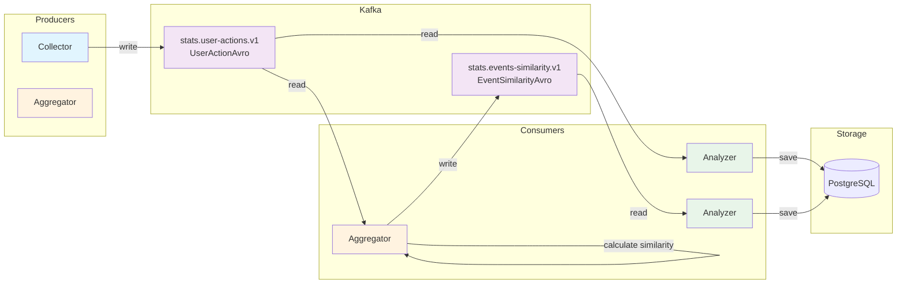

# Kafka Schemas Documentation

## Обзор

В проекте используется Apache Kafka для потоковой обработки данных статистики. Определены две Avro-схемы и два топика.

---

## Топики

| Топик | Тип | Producer | Consumer | Описание |
|-------|-----|----------|----------|----------|
| `stats.user-actions.v1` | UserActionAvro | collector | aggregator, analyzer | Действия пользователей (просмотры, лайки, регистрации) |
| `stats.events-similarity.v1` | EventSimilarityAvro | aggregator | analyzer | Матрица схожести событий |

---

## Avro Схемы

### UserActionAvro

**Файл:** `stats/serialization/avro-schemas/src/main/avro/stats/UserAction.avdl`

**Пакет:** `ru.practicum.ewm.stats.avro`

| Поле | Тип | Описание |
|------|-----|----------|
| `user_id` | long | ID пользователя |
| `event_id` | long | ID события |
| `action_type` | ActionTypeAvro | Тип действия |
| `timestamp` | timestamp_ms | Время действия (Unix timestamp в миллисекундах) |

**ActionTypeAvro**

| Значение | Описание |
|----------|----------|
| `VIEW` | Просмотр события |
| `REGISTER` | Регистрация на событие |
| `LIKE` | Лайк события |

**Пример сообщения:**

```json
{
  "user_id": 12345,
  "event_id": 67890,
  "action_type": "LIKE",
  "timestamp": 1743513600000
}
```

---

### EventSimilarityAvro

**Файл:** `stats/serialization/avro-schemas/src/main/avro/stats/EventSimilarity.avdl`

**Пакет:** `ru.practicum.ewm.stats.avro`

| Поле | Тип | Описание |
|------|-----|----------|
| `eventA` | long | ID первого события |
| `eventB` | long | ID второго события |
| `score` | double | Коэффициент схожести (0.0 - 1.0) |
| `timestamp` | timestamp_ms | Время расчета |

**Пример сообщения:**

```json
{
  "eventA": 100,
  "eventB": 200,
  "score": 0.85,
  "timestamp": 1743513600000
}
```

---

## Потоки данных



---

## Конфигурация

### Producer (collector)

```yaml
collector:
  kafka:
    producer:
      properties:
        bootstrap.servers: ${KAFKA_BOOTSTRAP_SERVERS:localhost:9092}
        client.id: "stats.collector"
        key.serializer: org.apache.kafka.common.serialization.LongSerializer
        value.serializer: ru.yandex.practicum.kafka.serializer.GeneralAvroSerializer
      topics:
        user-actions: stats.user-actions.v1
```

### Producer and Consumer (aggregator)

```yaml
aggregator:
  kafka:
    producer:
      properties:
        bootstrap.servers: ${KAFKA_BOOTSTRAP_SERVERS:localhost:9092}
        client.id: "stats.aggregator"
        key.serializer: org.apache.kafka.common.serialization.StringSerializer
        value.serializer: ru.yandex.practicum.kafka.serializer.GeneralAvroSerializer
      topics:
        events-similarity: stats.events-similarity.v1
    consumer:
      properties:
        bootstrap.servers: ${KAFKA_BOOTSTRAP_SERVERS:localhost:9092}
        group.id: aggregator-group
        key.deserializer: org.apache.kafka.common.serialization.LongDeserializer
        value.deserializer: ru.yandex.practicum.kafka.deserializer.UserActionDeserializer
        auto.offset.reset: latest
        enable.auto.commit: false
      topics:
        user-actions: stats.user-actions.v1
```

### Consumer (analyzer)

```yaml
analyzer:
  kafka:
    consumer-actions:
      properties:
        bootstrap.servers: ${KAFKA_BOOTSTRAP_SERVERS:localhost:9092}
        group.id: analyzer-actions-group
        key.deserializer: org.apache.kafka.common.serialization.LongDeserializer
        value.deserializer: ru.yandex.practicum.kafka.deserializer.UserActionDeserializer
        auto.offset.reset: latest
        enable.auto.commit: false
      topics:
        user-actions: stats.user-actions.v1
    consumer-similarities:
      properties:
        bootstrap.servers: ${KAFKA_BOOTSTRAP_SERVERS:localhost:9092}
        group.id: analyzer-similarities-group
        key.deserializer: org.apache.kafka.common.serialization.StringDeserializer
        value.deserializer: ru.yandex.practicum.kafka.deserializer.EventSimilarityDeserializer
        auto.offset.reset: latest
        enable.auto.commit: false
      topics:
        events-similarity: stats.events-similarity.v1
```